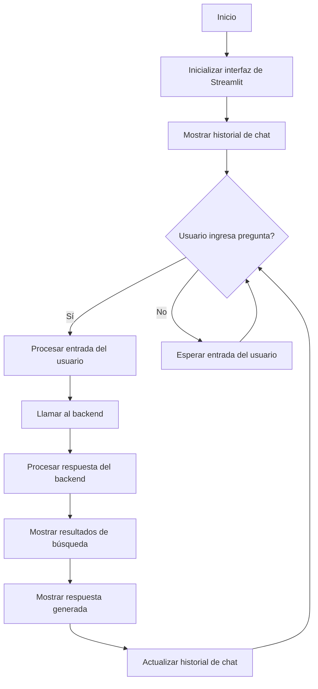
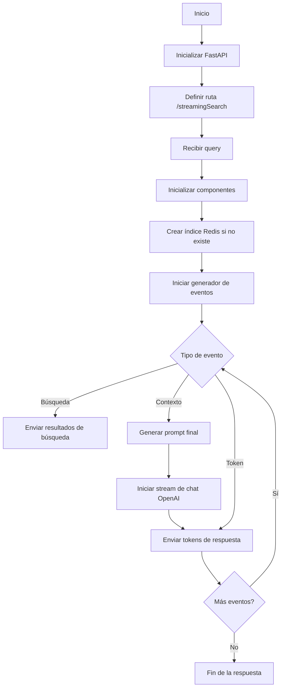

<p align="center">
<p align="center">
  
</p>
</p>
<p align="center">
    <h1 align="center">CAP05_CHALLENGE_INTERNETWHISPER</h1>
</p>
<p align="center">
    <em><code>Chatbot de IA con acceso a Internet</code></em>
</p>
<p align="center">
	
	
	
	
</p>
<p align="center">
		<em>Built with the tools and technologies:</em>
</p>
<p align="center">
	
	
	
	
	
	
	
	<br>
	
	
	
	
	
	
</p>

<br>

##### 🔗 Table of Contents

- [📍 Overview](#-overview)
- [👾 Features](#-features)
- [📂 Repository Structure](#-repository-structure)
- [🧩 Modules](#-modules)
- [🚀 Getting Started](#-getting-started)
    - [🔖 Prerequisites](#-prerequisites)
    - [📦 Installation](#-installation)
    - [🤖 Usage](#-usage)
    - [🧪 Tests](#-tests)
- [🤝 Contributing](#-contributing)
- [🎗 License](#-license)
- [🙌 Acknowledgments](#-acknowledgments)


## 📍 Overview

InternetWhisper es un chatbot conversacional de inteligencia artificial avanzado que tiene la capacidad única de acceder a Internet en tiempo real. Inspirado en You.com y Google's Bard, este proyecto combina la potencia de la IA generativa con la vasta información disponible en la web para proporcionar respuestas informadas y actualizadas a las consultas de los usuarios.


## 👾 Features

### InternetWhisper: Arquitectura Moderna y Eficiente

1. **FastAPI**: Framework web para crear APIs de manera rápida y eficiente.
2. **OpenAI GPT-3.5 Turbo**: Motor de IA para generar respuestas coherentes y contextuales.
3. **Redis Vector DB**: Base de datos vectorial para almacenar en caché información recuperada, optimizando el rendimiento.
4. **Google Custom Search API**: Para realizar búsquedas en Internet.
5. **Scraping**: Utiliza aiohttp (ScraperLocal) o Playwright (ScraperRemote) para extraer información de páginas web.
6. **Embeddings**: Usa OpenAIEmbeddings o RemoteEmbeddings para procesar texto.
7. **Docker**: Para contenerización y fácil despliegue.

### Componentes Principales

- **stream_chat**: Función que genera respuestas en tiempo real utilizando la API de OpenAI.
- **Retriever**: Módulo para recuperar y procesar información, incluyendo búsqueda, caché, scraping y procesamiento de texto.
- **EventSourceResponse**: Permite la comunicación en tiempo real entre el servidor y el cliente.

## 📂 Repository Structure

```sh
└── CAP05_CHALLENGE_InternetWhisper/
    ├── LICENSE
    ├── docker-compose.yml
    ├── pyproject.toml
    ├── redis_data
    │   └── dump.rdb
    ├── src
    │   ├── frontend
    │   │   ├── Dockerfile
    │   │   ├── diagrama_flujo.md
    │   │   ├── main.py
    │   │   └── requirements.txt
    │   ├── orchestrator
    │   │   ├── Dockerfile
    │   │   ├── diagrama_flujo.md
    │   │   ├── diagrama_subgrafos.md
    │   │   ├── logging.conf
    │   │   ├── main.py
    │   │   ├── mocks
    │   │   │   └── test_dict.py
    │   │   ├── models
    │   │   │   ├── document.py
    │   │   │   └── search.py
    │   │   ├── prompt
    │   │   │   ├── __init__.py
    │   │   │   └── prompt.py
    │   │   ├── requirements.txt
    │   │   ├── retrieval
    │   │   │   ├── __init__.py
    │   │   │   ├── cache.py
    │   │   │   ├── embeddings.py
    │   │   │   ├── retriever.py
    │   │   │   ├── scraper.py
    │   │   │   ├── search.py
    │   │   │   └── splitter.py
    │   │   └── util
    │   │       ├── __init__.py
    │   │       └── logger.py
    │   └── scraper
    │       ├── Dockerfile
    │       ├── main.py
    │       ├── nginx.conf
    │       └── requirements.txt
    └── tests
        └── __init__.py
```
## 📌 Diagrama de flujo - frontend



## 📌 Diagrama de flujo - Orchestrator



## 🧩 Modules

<details closed><summary>/.</summary>

| File |
| --- |
| [pyproject.toml](https://github.com/Mvargas08/CAP05_CHALLENGE_InternetWhisper/blob/main/pyproject.toml) |
| [docker-compose.yml](https://github.com/Mvargas08/CAP05_CHALLENGE_InternetWhisper/blob/main/docker-compose.yml) |

</details>

<details closed><summary>src.orchestrator</summary>

| File |
| --- |
| [main.py](https://github.com/Mvargas08/CAP05_CHALLENGE_InternetWhisper/blob/main/src/orchestrator/main.py) |
| [requirements.txt](https://github.com/Mvargas08/CAP05_CHALLENGE_InternetWhisper/blob/main/src/orchestrator/requirements.txt) |
| [logging.conf](https://github.com/Mvargas08/CAP05_CHALLENGE_InternetWhisper/blob/main/src/orchestrator/logging.conf) |
| [Dockerfile](https://github.com/Mvargas08/CAP05_CHALLENGE_InternetWhisper/blob/main/src/orchestrator/Dockerfile) |

</details>

<details closed><summary>src.orchestrator.mocks</summary>

| File |
| --- |
| [test_dict.py](https://github.com/Mvargas08/CAP05_CHALLENGE_InternetWhisper/blob/main/src/orchestrator/mocks/test_dict.py) |

</details>

<details closed><summary>src.orchestrator.models</summary>

| File |
| --- |
| [document.py](https://github.com/Mvargas08/CAP05_CHALLENGE_InternetWhisper/blob/main/src/orchestrator/models/document.py) |
| [search.py](https://github.com/Mvargas08/CAP05_CHALLENGE_InternetWhisper/blob/main/src/orchestrator/models/search.py) |

</details>

<details closed><summary>src.orchestrator.retrieval</summary>

| File |
| --- |
| [retriever.py](https://github.com/Mvargas08/CAP05_CHALLENGE_InternetWhisper/blob/main/src/orchestrator/retrieval/retriever.py) |
| [scraper.py](https://github.com/Mvargas08/CAP05_CHALLENGE_InternetWhisper/blob/main/src/orchestrator/retrieval/scraper.py) |
| [cache.py](https://github.com/Mvargas08/CAP05_CHALLENGE_InternetWhisper/blob/main/src/orchestrator/retrieval/cache.py) |
| [splitter.py](https://github.com/Mvargas08/CAP05_CHALLENGE_InternetWhisper/blob/main/src/orchestrator/retrieval/splitter.py) |
| [embeddings.py](https://github.com/Mvargas08/CAP05_CHALLENGE_InternetWhisper/blob/main/src/orchestrator/retrieval/embeddings.py) |
| [search.py](https://github.com/Mvargas08/CAP05_CHALLENGE_InternetWhisper/blob/main/src/orchestrator/retrieval/search.py) |

</details>

<details closed><summary>src.orchestrator.prompt</summary>

| File |
| --- |
| [prompt.py](https://github.com/Mvargas08/CAP05_CHALLENGE_InternetWhisper/blob/main/src/orchestrator/prompt/prompt.py) |

</details>

<details closed><summary>src.orchestrator.util</summary>

| File |
| --- |
| [logger.py](https://github.com/Mvargas08/CAP05_CHALLENGE_InternetWhisper/blob/main/src/orchestrator/util/logger.py) |

</details>

<details closed><summary>src.frontend</summary>

| File |
| --- |
| [main.py](https://github.com/Mvargas08/CAP05_CHALLENGE_InternetWhisper/blob/main/src/frontend/main.py) |
| [requirements.txt](https://github.com/Mvargas08/CAP05_CHALLENGE_InternetWhisper/blob/main/src/frontend/requirements.txt) |
| [Dockerfile](https://github.com/Mvargas08/CAP05_CHALLENGE_InternetWhisper/blob/main/src/frontend/Dockerfile) |

</details>

<details closed><summary>src.scraper</summary>

| File |
| --- |
| [nginx.conf](https://github.com/Mvargas08/CAP05_CHALLENGE_InternetWhisper/blob/main/src/scraper/nginx.conf) |
| [main.py](https://github.com/Mvargas08/CAP05_CHALLENGE_InternetWhisper/blob/main/src/scraper/main.py) |
| [requirements.txt](https://github.com/Mvargas08/CAP05_CHALLENGE_InternetWhisper/blob/main/src/scraper/requirements.txt) |
| [Dockerfile](https://github.com/Mvargas08/CAP05_CHALLENGE_InternetWhisper/blob/main/src/scraper/Dockerfile) |

</details>

<details closed><summary>redis_data</summary>

| File |
| --- |
| [dump.rdb](https://github.com/Mvargas08/CAP05_CHALLENGE_InternetWhisper/blob/main/redis_data/dump.rdb) |

</details>


## 🚀 Getting Started

### 🔖 Prerequisites

**Python**: `version x.y.z`

### 📦 Installation

Build the project from source:

1. Clone the CAP05_CHALLENGE_InternetWhisper repository:
```sh
❯ git clone https://github.com/Mvargas08/CAP05_CHALLENGE_InternetWhisper
```

2. Navigate to the project directory:
```sh
❯ cd CAP05_CHALLENGE_InternetWhisper
```

3. Install the required dependencies:
```sh
❯ pip install -r requirements.txt
```

### 🤖 Usage

To run the project, execute the following command:

```sh
❯ python main.py
```

### 🧪 Tests

Execute the test suite using the following command:

```sh
❯ pytest
```

## 🔧 Configuration

- **HEADER_ACCEPT_ENCODING**=gzip
- **HEADER_USER_AGENT**=Mozilla/5.0 (Macintosh; Intel Mac OS X 10_15_7) AppleWebKit/537.36 (KHTML, like Gecko) Chrome/116.0.0.0 Safari/537.36 (gzip)
- **GOOGLE_API_HOST**=https://www.googleapis.com/customsearch/v1?
- **GOOGLE_FIELDS**=items(title, displayLink, link, snippet,pagemap/cse_thumbnail)
- **GOOGLE_API_KEY**= Tu clave API de Google
- **GOOGLE_CX**= Tu ID de motor de búsqueda personalizado
- **OPENAI_API_KEY**= Tu clave API de OpenAI

## Ejecución en local

- Clona el repositorio.
- Configura las variables de entorno como se indicó anteriormente.
- Ejecuta los siguientes comandos:

```sh
   ❯ docker-compose build
   ❯ docker-compose up
```
## Elige tu clase de scraper

El proyecto incluye dos clases de scraper:

- **ScraperLocal**: Utiliza aiohttp para el web scraping (por defecto).
- **ScraperRemote**: Utiliza Playwright en un contenedor replicado separado para un renderizado de JavaScript más complejo.

Para cambiar entre las clases de scraper, modifica el archivo `orchestrator/main.py` y descomenta los servicios scraper y lb-scraper apropiados en `docker-compose.yml`.

- **OpenAIEmbeddings**: La opción por defecto, usando los embeddings de OpenAI.

## Acceso al Chatbot

Después de ejecutar la aplicación, abre tu navegador web y navega a [http://localhost:8501/](http://localhost:8501/) para interactuar con el chatbot.

## APIs Disponibles
- **GET /streamingSearch**
Endpoint principal para realizar búsquedas y obtener respuestas del chatbot.

### Parámetros:
- **query (string, requerido):** La consulta del usuario.
- **Respuesta:** Stream de eventos en formato text/event-stream.
- **Uso:** Realiza una solicitud GET a http://orchestrator/streamingSearch?query=tu_consulta_aquí.

Este endpoint procesa la consulta del usuario, realiza búsquedas en Internet si es necesario, y devuelve una respuesta generada por la IA en tiempo real.

## Definición OpenAPI
```yaml
openapi: "3.0.0"
info:
  title: "FastAPI"
  version: "0.1.0"
paths:
  /streamingSearch:
    get:
      summary: "Main"
      operationId: "main_streamingSearch_get"
      parameters:
        - name: "query"
          in: "query"
          required: true
          schema:
            title: "Query"
            type: "string"
      responses:
        '200':
          description: "Successful Response"
          content:
            text/event-stream:
              schema:
                title: "Response"
                type: "string"

```

## 🤝 Contributing

Contributions are welcome! Here are several ways you can contribute:

- **[Report Issues](https://github.com/Mvargas08/CAP05_CHALLENGE_InternetWhisper/issues)**: Submit bugs found or log feature requests for the `CAP05_CHALLENGE_InternetWhisper` project.
- **[Submit Pull Requests](https://github.com/Mvargas08/CAP05_CHALLENGE_InternetWhisper/blob/main/CONTRIBUTING.md)**: Review open PRs, and submit your own PRs.
- **[Join the Discussions](https://github.com/Mvargas08/CAP05_CHALLENGE_InternetWhisper/discussions)**: Share your insights, provide feedback, or ask questions.

<details closed>
<summary>Contributing Guidelines</summary>

1. **Fork the Repository**: Start by forking the project repository to your github account.
2. **Clone Locally**: Clone the forked repository to your local machine using a git client.
   ```sh
   git clone https://github.com/Mvargas08/CAP05_CHALLENGE_InternetWhisper
   ```
3. **Create a New Branch**: Always work on a new branch, giving it a descriptive name.
   ```sh
   git checkout -b new-feature-x
   ```
4. **Make Your Changes**: Develop and test your changes locally.
5. **Commit Your Changes**: Commit with a clear message describing your updates.
   ```sh
   git commit -m 'Implemented new feature x.'
   ```
6. **Push to github**: Push the changes to your forked repository.
   ```sh
   git push origin new-feature-x
   ```
7. **Submit a Pull Request**: Create a PR against the original project repository. Clearly describe the changes and their motivations.
8. **Review**: Once your PR is reviewed and approved, it will be merged into the main branch. Congratulations on your contribution!
</details>

<details closed>
<summary>Contributor Graph</summary>
<br>
<p align="left">
   <a href="https://github.com{/Mvargas08/CAP05_CHALLENGE_InternetWhisper/}graphs/contributors">
      
   </a>
</p>
</details>

